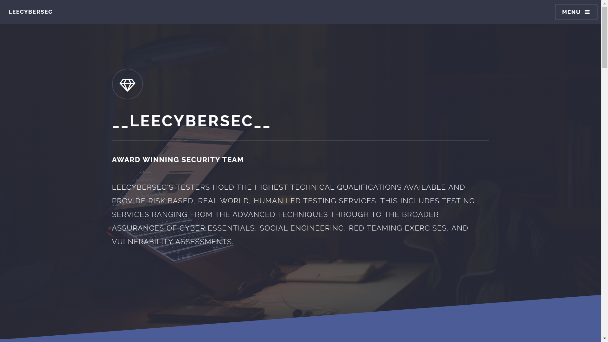
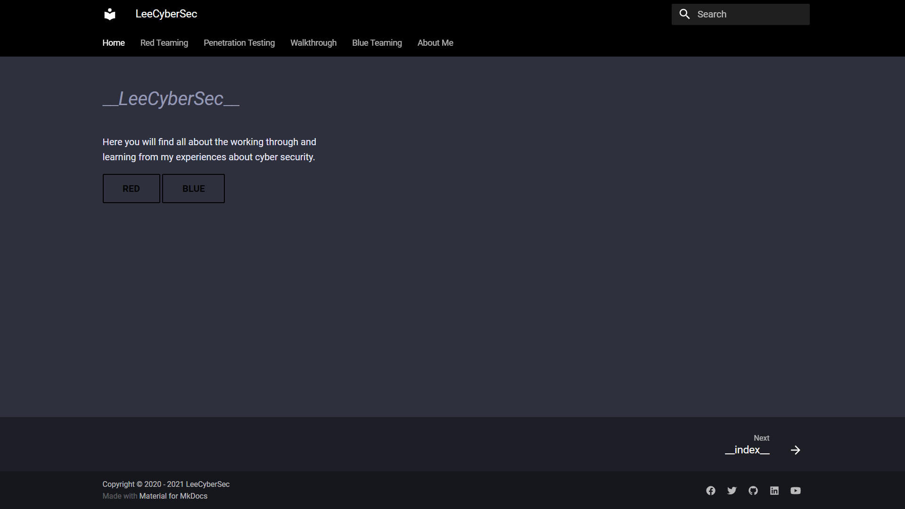

# LeeCyberSec

> Author: Hades <br>
> [*Github*](https://github.com/leecybersec)

# leecybersec.com



## docs-leecybersec.github.io



`Download script`

``` bash
git clone https://github.com/leecybersec/scripting.git
```

<div style="page-break-after: always; visibility: hidden"> \pagebreak </div>

# Openning Services

``` bash
┌──(Hades㉿192.168.56.110)-[4.4:24.5]~/scripting/enum
└─$ sudo ./auto_enum.sh 192.168.56.102

Scanning openning port ...
[+] Openning ports: 25,80,3000
```

# 25

``` bash
PORT     STATE SERVICE         VERSION
25/tcp   open  smtp            Postfix smtpd
|_smtp-commands: straylight, PIPELINING, SIZE 10240000, VRFY, ETRN, STARTTLS, ENHANCEDSTATUSCODES, 8BITMIME, DSN, SMTPUTF8, 
| ssl-cert: Subject: commonName=straylight
| Subject Alternative Name: DNS:straylight
| Not valid before: 2018-05-12T18:08:02
|_Not valid after:  2028-05-09T18:08:02
|_ssl-date: TLS randomness does not represent time
```

# 80 & 3000

``` bash
80/tcp   open  http            Apache httpd 2.4.25 ((Debian))
|_http-server-header: Apache/2.4.25 (Debian)
|_http-title: Night City
<snip>
3000/tcp open  hadoop-datanode Apache Hadoop
| hadoop-datanode-info: 
|_  Logs: submit
| hadoop-tasktracker-info: 
|_  Logs: submit
| http-title: Welcome to ntopng
|_Requested resource was /lua/login.lua?referer=/
|_http-trane-info: Problem with XML parsing of /evox/about
MAC Address: 08:00:27:96:17:9F (Oracle VirtualBox virtual NIC)
Service Info: Host:  straylight
```